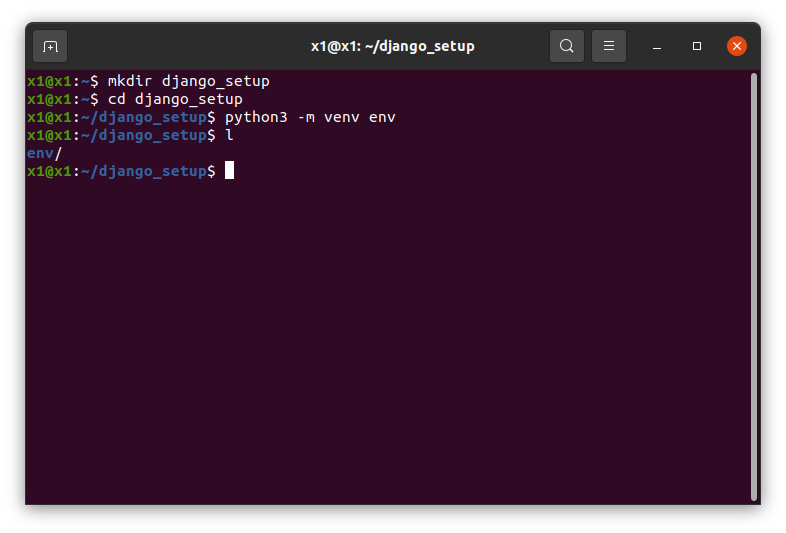
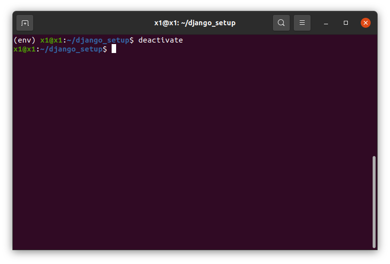
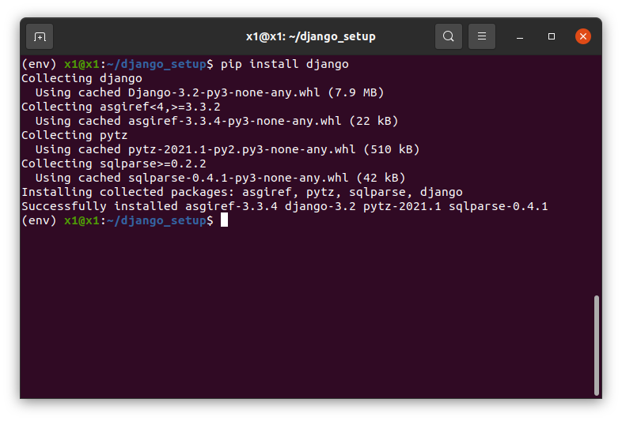
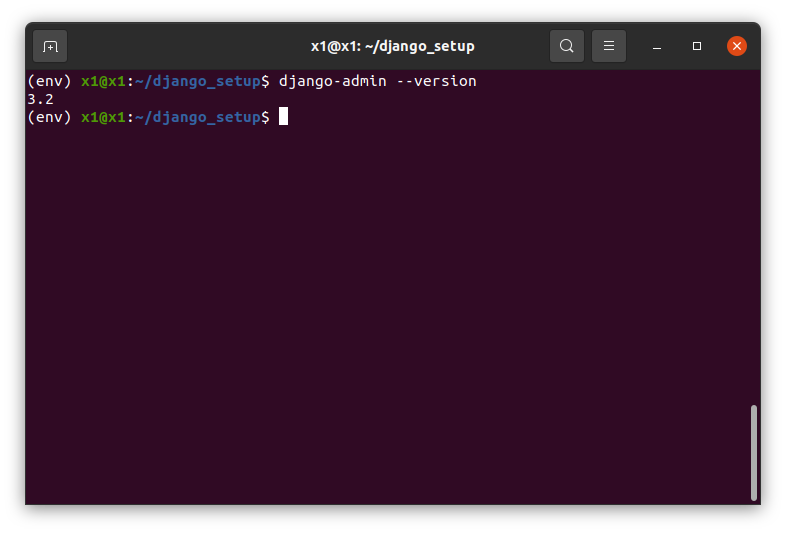
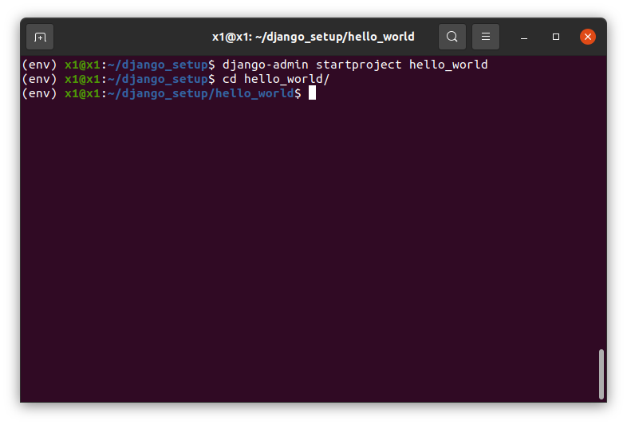
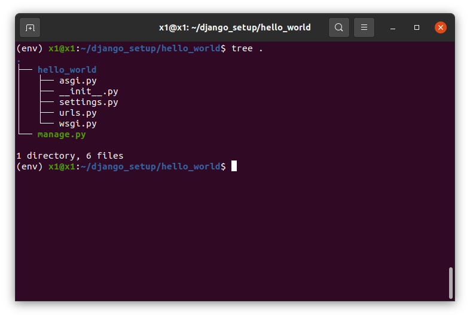
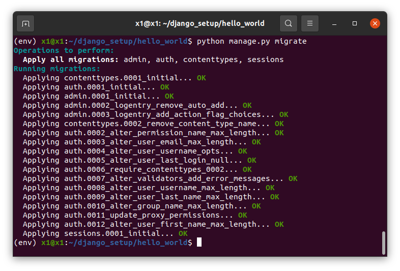
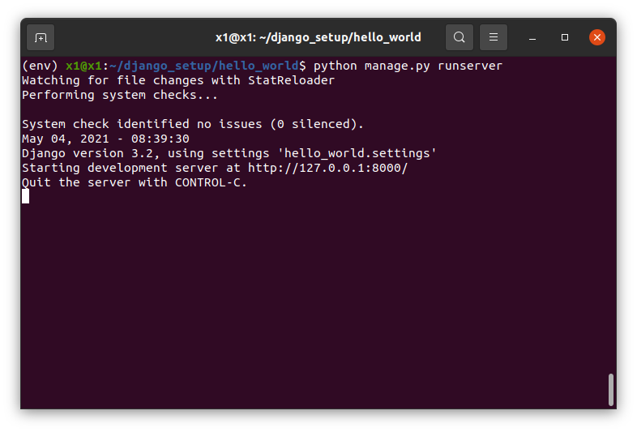

# How to setup Django in Ubuntu

<br/>

## What is Django ?

[Django](https://www.djangoproject.com/ "Django official site") is a high-level Python Web framework that encourages rapid development and clean, pragmatic design. Built by experienced developers, it takes care of much of the hassle of Web development, so you can focus on writing your app without needing to reinvent the wheel. It’s free and open source.

## Installation

Before Django installation, we need to install some other packages.

### Python

[Python](https://www.python.org/ "Python official site") is a high-level, interpreted, interactive and object-oriented scripting language. Python is designed to be highly readable. It uses English keywords frequently where as other languages use punctuation, and it has fewer syntactical constructions than other languages.

You can download and install python for [Linux/UNIX](https://www.python.org/downloads/source/ "Download python for Linux/UNIX").

Or, you can install python from terminal

##### install

```terminal
sudo apt update
```

```terminal
sudo apt install software-properties-common
sudo add-apt-repository ppa:deadsnakes/ppa
sudo apt update
sudo apt install python3.8
```

##### Verify install

```terminal
python3 --version
```


---

### Pip

[pip](https://pypi.org/project/pip/ "pip") is the package installer for Python. You can use pip to install packages from the Python Package Index and other indexes.

##### install

```terminal
sudo apt-get update
```

```terminal
sudo apt-get install python3-pip
```

##### Verify install

```terminal
pip3 --version
```


---

### Virtual Environment

[Virtualenv](https://virtualenv.pypa.io/en/latest/#:~:text=virtualenv%20is%20a%20tool%20to,library%20under%20the%20venv%20module. "virtualenv") is a tool to create isolated Python environments.

##### install

```terminal
sudo apt install python3-virtualenv
```

##### Verify install

```terminal
virtualenv --version
```


## Virtual Environment Setup

##### create virtual environment

```terminal
mkdir django_setup
cd django_setup
python3 -m venv env
```



---

### Activating virtual environment

```terminal
source env/bin/activate
```


### Deactivating virtual environment

```terminal
deactivate
```



## Django installation

**Note :- Before proceeding to installation, activate your virtual environment (env), otherwise Django will be installed on your system (not in virtual environment), which can cause errors for future projects**

##### install django

```terminal
pip install django
```



##### Verify installation

```terminal
django-admin --version
```



## Project Setup

#### Create a django project

```terminal
django-admin startproject hello_world
cd hello_world
```



This command will create a hello_world folder (i.e. a django project) with basic django folder structure.

#### Project folder structure

```terminal
tree .
```



## Running localhost

**You will see a warning about unapplied migrations for the first time runserver command. So, we have to migrate all migrations before first time runserver command.**

##### migrate command

```terminal
python manage.py migrate
```



##### runserver command

```terminal
python manage.py runserver
```



---

#### First look of project

This is the default homepage provided by Django.


<br/>

---
