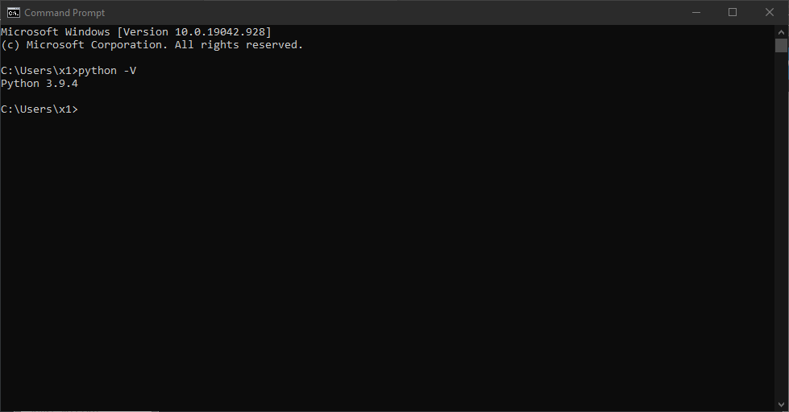
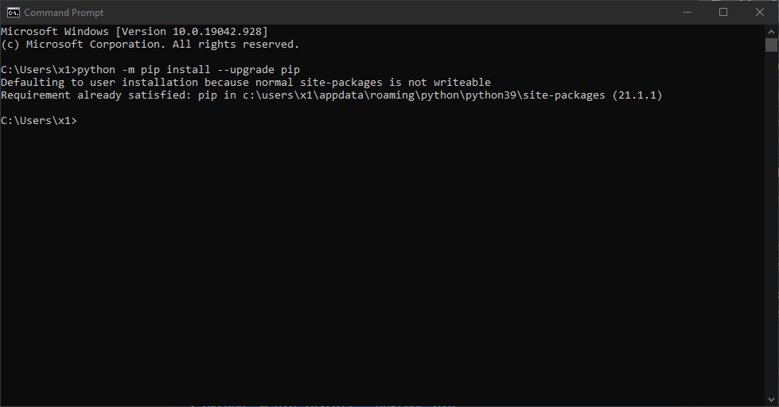
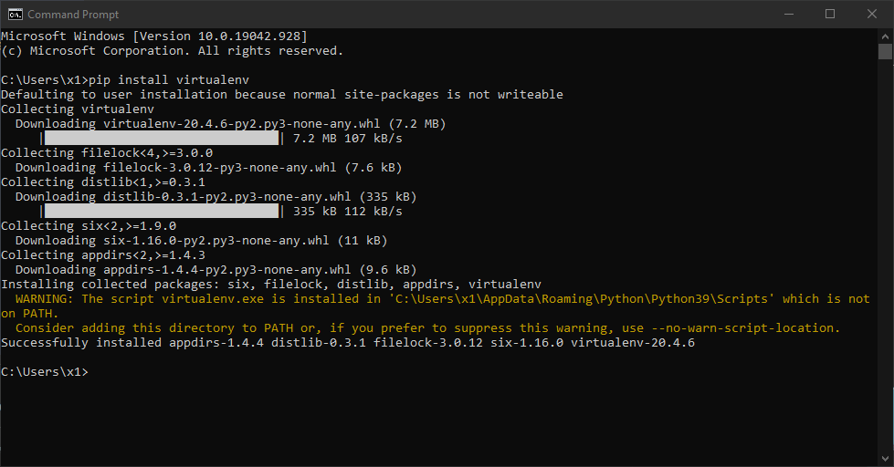
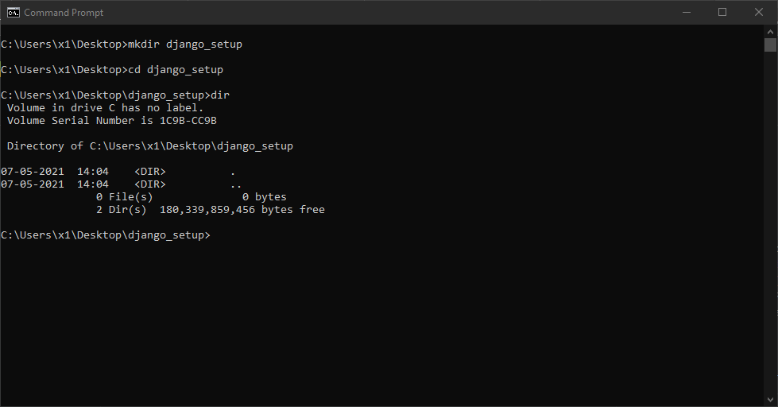
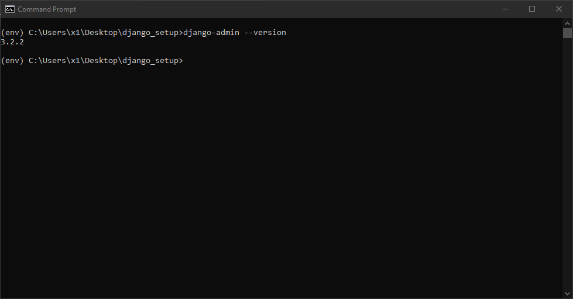
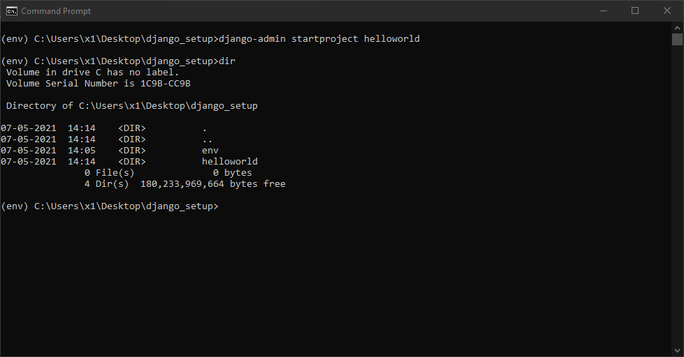
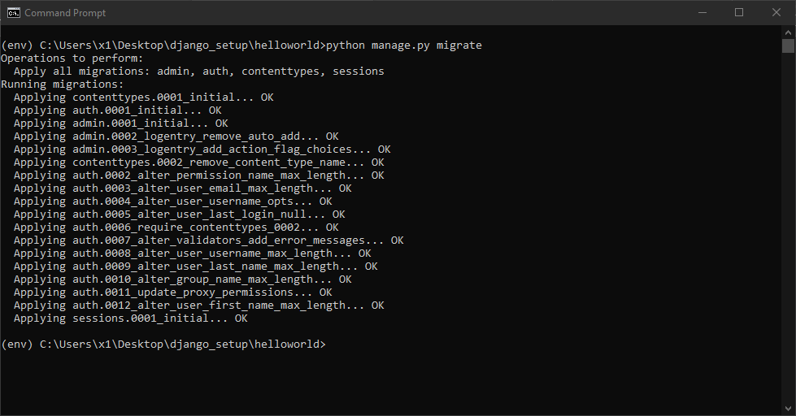
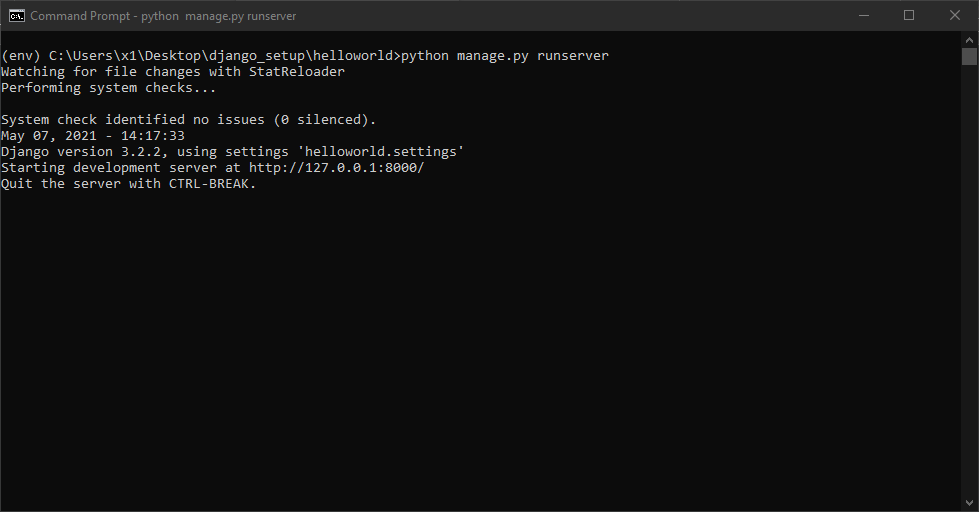
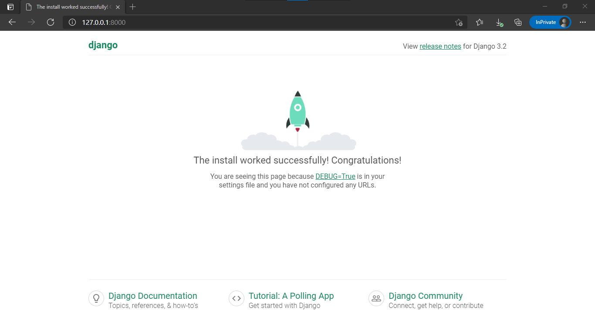

# How to setup Django in Windows

<br/>

## What is Django ?

[Django](https://www.djangoproject.com/ "Django official site") is a high-level Python Web framework that encourages rapid development and clean, pragmatic design. Built by experienced developers, it takes care of much of the hassle of Web development, so you can focus on writing your app without needing to reinvent the wheel. It’s free and open source.

## Installation

Before Django installation, we need to install some other packages.

### Python

[Python](https://www.python.org/ "Python official site") is a high-level, interpreted, interactive and object-oriented scripting language. Python is designed to be highly readable. It uses English keywords frequently where as other languages use punctuation, and it has fewer syntactical constructions than other languages.

Check wether python is installed on you windows by running command

```cmd
python -V
```



*If python is not installed in your windows*, [follow this](/python/how-to-install-python-in-windows)

---

### Pip

[pip](https://pypi.org/project/pip/ "pip") is the package installer for Python. You can use pip to install packages from the Python Package Index and other indexes.

You can upgrade pip by running command

```cmd
python -m pip install --upgrade pip
```



---

### Virtual Environment

[Virtualenv](https://virtualenv.pypa.io/en/latest/#:~:text=virtualenv%20is%20a%20tool%20to,library%20under%20the%20venv%20module. "virtualenv") is a tool to create isolated Python environments.

```cmd
pip install virtualenv
```



## Virtual Environment Setup

```cmd
mkdir django_setup
cd django_setup
```



```cmd
python -m venv env
```


---

### Activating virtual environment

```cmd
env/Scripts/activate
```


---

### Deactivating virtual environment

```cmd
deactivate
```


---

### Django installation

**Note :- Before proceeding to installation, activate your virtual environment (env), otherwise Django will be installed on your system (not in virtual environment), which can cause errors for future projects**

##### install

```cmd
pip install django
```


##### Verify installation

```cmd
django-admin --version
```



## Project Setup

<br/>

#### Create a django project

```cmd
django-admin startproject hello_world
cd hello_world
```



This command will create a hello_world folder (i.e. a django project) with basic django folder structure.

## Running localhost


**You will see a warning about unapplied migrations for the first time runserver command. So, we have to migrate all migrations before first time runserver command.**

```cmd
python manage.py migrate
```



```cmd
python manage.py runserver
```



---

#### First look of project

This is the default homepage provided by Django.



<br/>

---
