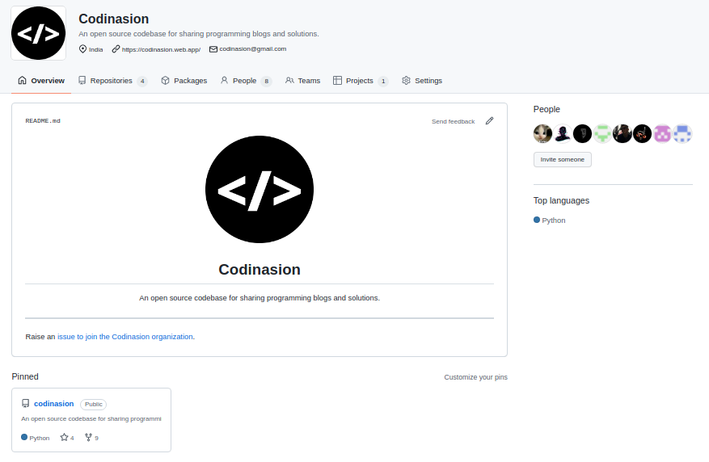

<Hero slots="heading, text" background="rgb(50 50 50)" />

# Codinasion

An open source codebase for sharing programming blogs and solutions.

<TextBlock slots="image, heading, text1, links" />

### Codinasion

We are building an open source community of amazing people interested in programming, to share their programming skills through solutions and programming blogs.

-  [Github](https://github.com/codinasion)
-  [Join Us](https://github.com/codinasion/codinasion-invite/issues/new?assignees=&labels=invite+me+to+the+organization&template=invitation.yml&title=Please+invite+me+to+the+GitHub+Community+Organization)
-  [Source Repo](https://github.com/codinasion/codinasion)
